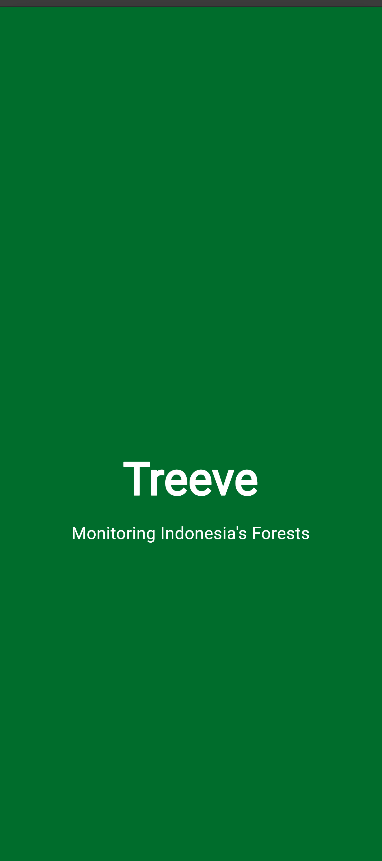
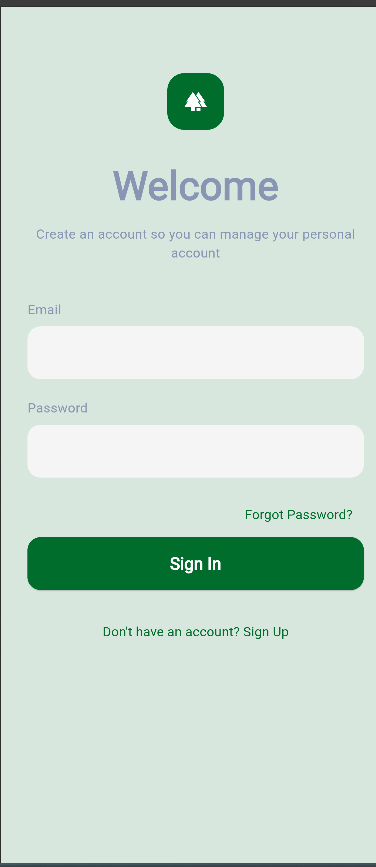

# Treeve 🌳

Treeve is a mobile application developed using Flutter to support forest monitoring and environmental reporting in Indonesia. The application provides an intuitive interface for users to access forest-related information, receive alerts, and submit reports regarding environmental damage.

---

## Features

### Authentication
- Splash Screen
- Login
- Register
- Account Verification

### Home
- Dashboard Overview
- Forest Monitoring Information
- News & Updates

### Maps
- Forest Monitoring Map
- Location Tracking

### Alerts
- Environmental Alerts
- Damage Notifications

### Report
- Damage Reporting Form
- Location Selection
- Report Submission

### Profile
- User Profile Management
- Account Information

---

## Tech Stack

- Flutter
- Dart
- Material Design
- Provider (State Management)

---

## Project Structure

```text
lib/
│
├── core/
│   ├── constants/
│   ├── theme/
│   └── utils/
│
├── features/
│   ├── alerts/
│   ├── auth/
│   ├── home/
│   ├── maps/
│   ├── navigation/
│   ├── profile/
│   └── report/
│
├── shared/
│   └── widgets/
│
└── main.dart
```

---

## Installation

### Clone Repository

```bash
git clone https://github.com/your-username/treeve.git
```

### Navigate to Project Directory

```bash
cd treeve
```

### Install Dependencies

```bash
flutter pub get
```

### Run Application

```bash
flutter run
```

---

## Current Progress

The current development stage focuses on:

- Splash Screen
- Login Screen
- Registration Screen
- Verification Screen
- UI Design Implementation
- Project Architecture Setup

Future development will include:

- Forest Monitoring Dashboard
- Interactive Maps
- Alert Management
- Damage Reporting System
- User Profile Features
- Backend Integration

---

## Screenshots

## Screenshots

### Splash Screen


### Login Screen


### Register Screen


### Verification Screen


---

## Author

**Muhammad Abdullah**  
Data Science Student  
Cakrawala University

---

## License

This project is developed for academic purposes as part of the Mobile Computing course project.
